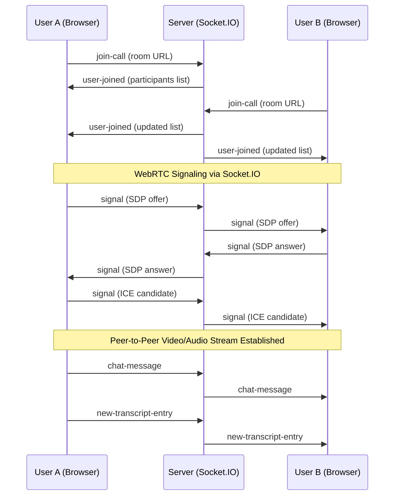

<p align="center">
  
</p>

<h1 align="center">🎥 NEXUS — Video Conferencing Platform</h1>

<p align="center">
  A full-stack, real-time video conferencing web application built with the <strong>MERN stack</strong> and <strong>WebRTC</strong>.<br/>
  Connect face-to-face from anywhere — with live chat, screen sharing, speech-to-text captions, and AI-powered meeting recaps.
</p>

<p align="center">
  
  
  
  
  
  
</p>

---

## ✨ Features

| Feature | Description |
|---|---|
| **🎥 Video Calling** | Peer-to-peer video calls powered by WebRTC with STUN server connectivity |
| **🖥️ Screen Sharing** | Share your entire screen or a specific window with other participants |
| **💬 Real-time Chat** | In-call text messaging via Socket.IO, with message history and unread badge |
| **🗣️ Live Captions** | Browser-native speech-to-text transcription using the Web Speech API |
| **📝 Meeting Log** | Persistent transcript sidebar with manual note-taking support |
| **🤖 AI Meeting Recap** | One-click meeting summarization powered by Google Gemini 1.5 Flash |
| **🔐 Authentication** | User registration & login with bcrypt password hashing and token-based auth |
| **📜 Meeting History** | View past meetings and their details from your personal history page |
| **👤 Guest Access** | Join meetings instantly without creating an account |

---

## 🏗️ Architecture Overview

```
NEXUS/
├── backend/                 # Express + Socket.IO server
│   └── src/
│       ├── app.js           # Entry point — Express, CORS, MongoDB, Socket.IO
│       ├── controllers/
│       │   ├── user.controller.js      # Register, Login, History
│       │   ├── meeting.controller.js   # AI-powered meeting summarization
│       │   └── socketManager.js        # WebRTC signaling & real-time events
│       ├── models/
│       │   ├── user.model.js           # User schema (name, username, password, token)
│       │   └── meeting.model.js        # Meeting schema (code, transcript, recap)
│       └── routes/
│           ├── users.routes.js         # /api/v1/users/*
│           └── meetings.routes.js      # /api/meetings/*
│
├── frontend/                # React + Vite SPA
│   └── src/
│       ├── App.jsx           # Root component with React Router
│       ├── main.jsx          # Vite entry point
│       ├── environment.js    # Server URL configuration
│       ├── contexts/
│       │   └── AuthContext.jsx         # Authentication state & API calls
│       ├── hooks/
│       │   └── useTranscription.js     # Web Speech API hook for live captions
│       ├── pages/
│       │   ├── landing.jsx             # Public landing page
│       │   ├── authentication.jsx      # Login / Register form
│       │   ├── home.jsx                # Dashboard — join or create meetings
│       │   ├── VideoMeet.jsx           # Core video conferencing room
│       │   └── history.jsx             # Past meeting history
│       ├── utils/
│       │   └── withAuth.jsx            # HOC for protected routes
│       └── styles/
│           └── videoComponent.module.css  # Video room scoped styles
│
├── nexus-adk-agent/         # Standalone Google ADK summarization Python agent
│   ├── main.py              # FastAPI service exposing the ADK Agent
│   ├── requirements.txt     # Python dependencies
│   └── Dockerfile           # Cloud Run deployment configuration
│
└── README.md
```

---

## 🛠️ Tech Stack

### Frontend
- **React 18** — Component-based UI with hooks
- **Vite** — Lightning-fast development server and build tool
- **Material UI (MUI) 5** — Pre-built UI components and icons
- **React Router DOM 6** — Client-side routing
- **Socket.IO Client** — Real-time bidirectional communication
- **WebRTC** — Peer-to-peer video/audio streaming
- **Web Speech API** — Browser-native speech recognition for live captions
- **React Markdown** — Renders AI-generated recap as formatted Markdown

### Backend
- **Node.js + Express** — RESTful API server
- **Socket.IO** — WebSocket server for signaling and real-time events
- **MongoDB + Mongoose** — NoSQL database for users and meetings
- **bcrypt** — Secure password hashing
- **Google Gemini AI** (`@google/genai`) — Meeting transcript summarization
- **dotenv** — Environment variable management

### Standalone AI Agent (Python)
- **FastAPI + Uvicorn** — Minimalist REST API server
- **Google Agent Development Kit (ADK)** — Core framework for the agent
- **Google Gemini 1.5 Flash** — LLM used by the agent for summarization
- **Docker** — Ready for Google Cloud Run deployment

---

## 🚀 Getting Started

### Prerequisites

- **Node.js** v18+ and **npm**
- **MongoDB** instance (local or [MongoDB Atlas](https://www.mongodb.com/atlas))
- **Google Gemini API Key** (for meeting summarization)

### 1. Clone the Repository

```bash
git clone https://github.com/your-username/NEXUS.git
cd NEXUS
```

### 2. Backend Setup

```bash
cd backend
npm install
```

Create a `.env` file in the `backend/` directory:

```env
MONGO_URI=mongodb+srv://<username>:<password>@cluster.mongodb.net/<dbname>
GEMINI_API_KEY=your_gemini_api_key_here
PORT=8000
```

Start the backend server:

```bash
# Development (with hot-reload)
npm run dev

# Production
npm start
```

The server will start on **http://localhost:8000**.

### 3. Frontend Setup

```bash
cd frontend
npm install
```

> **Note:** If running locally, update `frontend/src/environment.js` to point to your local backend:
> ```js
> const server = "http://localhost:8000";
> ```

Start the frontend dev server:

```bash
npm run dev
```

The app will be available at **http://localhost:5173**.

### 4. Standalone AI Agent Setup (Optional)

The repository also includes a standalone Python project (`nexus-adk-agent`) designed for deployment on Google Cloud Run. It uses the Google Agent Development Kit (ADK) to perform AI meeting summarization independently of the Express backend.

```bash
cd nexus-adk-agent
pip install -r requirements.txt
uvicorn main:app --reload --port 8080
```

*Note: You must set `GOOGLE_API_KEY` in your environment before running this agent.*

---

## 🔌 API Reference

### Users — `/api/v1/users`

| Method | Endpoint | Description |
|--------|----------|-------------|
| `POST` | `/register` | Register a new user (`name`, `username`, `password`) |
| `POST` | `/login` | Authenticate and receive a token (`username`, `password`) |
| `POST` | `/add_to_activity` | Save a meeting to user history (`token`, `meeting_code`) |
| `GET`  | `/get_all_activity?token=` | Retrieve all meetings for the authenticated user |

### Meetings — `/api/meetings`

| Method | Endpoint | Description |
|--------|----------|-------------|
| `POST` | `/summarize` | Generate an AI recap from a transcript (`meetingCode`, `transcript`) |

### Socket.IO Events

| Event | Direction | Description |
|-------|-----------|-------------|
| `join-call` | Client → Server | Join a meeting room by URL path |
| `user-joined` | Server → Client | Broadcast when a new participant joins |
| `user-left` | Server → Client | Broadcast when a participant disconnects |
| `signal` | Bidirectional | WebRTC signaling (SDP offers/answers, ICE candidates) |
| `chat-message` | Bidirectional | Send/receive in-call text messages |
| `new-transcript-entry` | Bidirectional | Share live transcript entries across participants |

---

## 🌐 Deployment

The application is deployed on **Render**:

| Service | URL |
|---------|-----|
| **Backend** | `https://nexus-videocall.onrender.com` |
| **Frontend** | `https://nexus-video-frontend.onrender.com` |

To deploy your own instance, set the environment variables (`MONGO_URI`, `GEMINI_API_KEY`) in your hosting provider's dashboard and update the CORS origin in `backend/src/app.js` and the server URL in `frontend/src/environment.js`.

---

## 📐 How It Works



1. **Signaling** — Socket.IO relays WebRTC SDP offers/answers and ICE candidates between peers
2. **Media Streaming** — Once signaling completes, video/audio flows directly peer-to-peer via WebRTC
3. **Chat & Transcripts** — Text messages and speech-to-text entries are broadcast through Socket.IO
4. **AI Recap** — The meeting transcript is sent to Google Gemini, which returns a structured Markdown summary

---

## 🤝 Contributing

Contributions are welcome! Feel free to open issues or submit pull requests.

1. Fork the repository
2. Create your feature branch (`git checkout -b feature/amazing-feature`)
3. Commit your changes (`git commit -m 'Add amazing feature'`)
4. Push to the branch (`git push origin feature/amazing-feature`)
5. Open a Pull Request

---

## 📄 License

This project is licensed under the **ISC License**.

---

<p align="center">
  Built with ❤️ using React, Node.js, WebRTC, and Gemini AI
</p>
